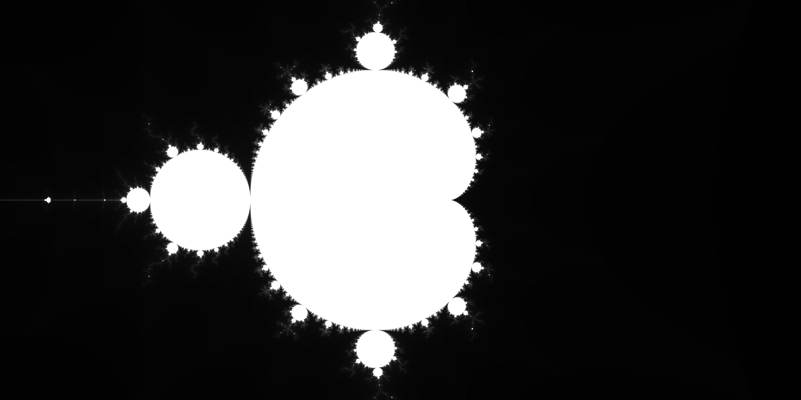

# fractals-wasm

https://en.wikipedia.org/wiki/Plotting_algorithms_for_the_Mandelbrot_set
## todo
- [x] render an image
- [x] save the image to a file
- [x] render fractals
- [ ] replace naive algorithm with an optimized one
- [ ] add anti-aliasing
- [ ] add ffmpeg support for video export
- [ ] web interface using web assembly
- [ ] add command line controls
- [ ] add more color templates
